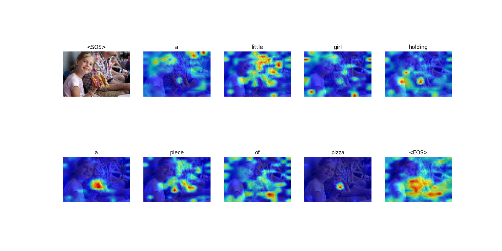

# Image Captioning and Attention Visualization

Image captioning with pretrained DeiT v3 as encoder on a subset of MSCOCO dataset

- CIDEr score: 0.9413
- CLIP score: 0.7310

Attention map visualization for image captioning:

See problem 2 & 3 in [Report.pdf](./Report.pdf) and [Spec.pdf](Spec.pdf)  more details.